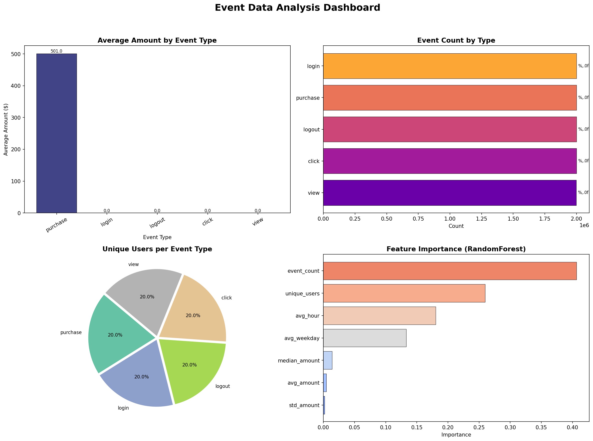

# Data Analysis Stack — DuckDB + Polars + Pandas + scikit-learn

A high-performance data analysis pipeline that demonstrates how to combine **DuckDB**, **Polars**, **Pandas**, and **scikit-learn** into a cohesive workflow — from synthetic data generation all the way through feature engineering, model training, and visualisation.

## Architecture

```
┌─────────────────────────────────────────────────────────────────────┐
│                        generate_data.py                             │
│  Faker + Polars + multiprocessing                                   │
│  → 10M rows across 100 batched Parquet files                        │
└──────────────────────────────┬──────────────────────────────────────┘
                               │  data/events_*.parquet
                               ▼
┌─────────────────────────────────────────────────────────────────────┐
│                           main.py                                   │
│                                                                     │
│  Step 1 │ DuckDB ─── SQL filter on Parquet (disk, zero-copy) ──→ Polars  │
│  Step 2 │ Polars ─── Feature engineering (group_by, agg) ────────────────│
│  Step 3 │ Pandas + sklearn ─── Model training (RandomForest) ────────────│
│  Step 4 │ Matplotlib ─── 4-panel dashboard saved to PNG ─────────────────│
└─────────────────────────────────────────────────────────────────────┘
```

Each tool is used for what it does best:

| Layer | Tool | Why |
|---|---|---|
| **Storage / SQL filtering** | DuckDB | Reads Parquet directly from disk with predicate pushdown — no need to load everything into memory |
| **Transformation** | Polars | Blazing-fast columnar transforms, window functions, and aggregations |
| **ML bridge** | Pandas | Seamless interop with scikit-learn (`.to_pandas()`) |
| **Modelling** | scikit-learn | Industry-standard ML with RandomForestClassifier |
| **Visualisation** | Matplotlib | Publication-quality charts saved as PNG |

## Dataset Schema

The synthetic event data has the following schema:

| Column | Type | Description |
|---|---|---|
| `user_id` | `String` (UUID) | Unique identifier for the user |
| `event_type` | `String` | One of: `login`, `logout`, `purchase`, `view`, `click` |
| `amount` | `Float64` | Transaction amount (non-zero only for `purchase` events; range $1–$1000) |
| `created_at` | `Datetime(μs)` | Timestamp of the event (randomly distributed over the past year) |

## Project Structure

```
.
├── README.md              # This file
├── pyproject.toml         # Project config and dependencies (managed by uv)
├── uv.lock                # Locked dependency versions
├── generate_data.py       # Synthetic data generator (multiprocessing)
├── main.py                # Analysis pipeline (DuckDB → Polars → sklearn → charts)
├── data/                  # Generated Parquet files (git-ignored)
│   ├── events_0000.parquet
│   ├── events_0001.parquet
│   └── ...                # 100 files, ~2.8 MB each, ~277 MB total
└── output/                # Generated charts
    └── dashboard.png      # 4-panel analysis dashboard
```

## Prerequisites

- **Python** ≥ 3.12
- [**uv**](https://docs.astral.sh/uv/) (fast Python package manager)

## Quick Start

### 1. Install dependencies

```bash
uv sync
```

### 2. Generate synthetic data (10 million rows)

```bash
uv run generate_data.py
```

This uses **multiprocessing** (`ProcessPoolExecutor`) to generate data in parallel across all available CPU cores. Each batch of 100,000 rows is written to a separate Parquet file, keeping memory usage low (~2.8 MB per file).

**Output:** 100 files in `data/events_*.parquet` (~277 MB total).  
**Time:** ~50 seconds (varies by CPU).

### 3. Run the analysis pipeline

```bash
uv run main.py
```

**Output:**
- Feature summary printed to the console
- `output/dashboard.png` — a 4-panel visualisation dashboard

## Pipeline Details

### Step 1 — Data Ingestion (DuckDB)

```sql
SELECT user_id, event_type, amount, created_at
FROM 'data/events_*.parquet'
WHERE created_at >= '2025-01-01'
```

DuckDB reads the globbed Parquet files directly from disk with predicate pushdown. The result is converted to a Polars DataFrame via `.pl()` (zero-copy when possible).

### Step 2 — Feature Engineering (Polars)

Polars computes derived columns and aggregations:

- **Derived columns:** `hour` (from timestamp), `weekday`, `rel_amount` (amount relative to global mean)
- **Aggregation by `event_type`:**
  - `avg_amount` — mean transaction amount
  - `std_amount` — standard deviation
  - `median_amount` — median transaction amount
  - `unique_users` — count of distinct users
  - `avg_hour` / `avg_weekday` — temporal patterns
  - `event_count` — total events per type

### Step 3 — Model Training (Pandas + scikit-learn)

The aggregated features are converted to Pandas and fed into a `RandomForestClassifier` (50 trees). Dummy binary labels are used for demonstration. The model's **feature importances** are extracted for visualisation.

### Step 4 — Visualisation (Matplotlib)

A 4-panel dashboard is saved to `output/dashboard.png`:

| Panel | Chart Type | Shows |
|---|---|---|
| Top-left | Bar chart | Average amount by event type |
| Top-right | Horizontal bar | Event count distribution |
| Bottom-left | Pie chart | Unique users per event type |
| Bottom-right | Horizontal bar | Feature importance from RandomForest |

## Dashboard Preview



## Dependencies

| Package | Version | Purpose |
|---|---|---|
| `duckdb` | ≥ 1.5.2 | SQL-based Parquet ingestion |
| `polars` | ≥ 1.40.1 | High-performance DataFrame transforms |
| `pandas` | ≥ 3.0.2 | sklearn interop |
| `pyarrow` | ≥ 24.0.0 | Parquet read/write backend |
| `faker` | ≥ 40.15.0 | Synthetic data generation |
| `scikit-learn` | ≥ 1.8.0 | Machine learning (RandomForestClassifier) |
| `matplotlib` | ≥ 3.10.9 | Chart visualisation |

## Configuration

Key constants in `generate_data.py`:

```python
TOTAL_ROWS  = 10_000_000   # Total rows to generate
BATCH_SIZE  = 100_000       # Rows per Parquet file
OUTPUT_DIR  = "data"        # Output directory
```

Adjust `TOTAL_ROWS` and `BATCH_SIZE` to control the volume and granularity of generated data.
